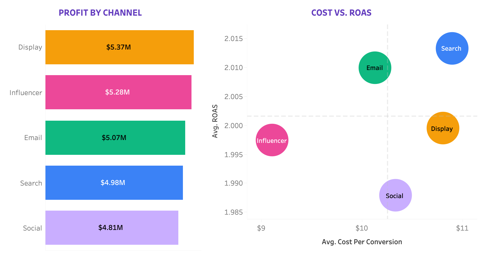
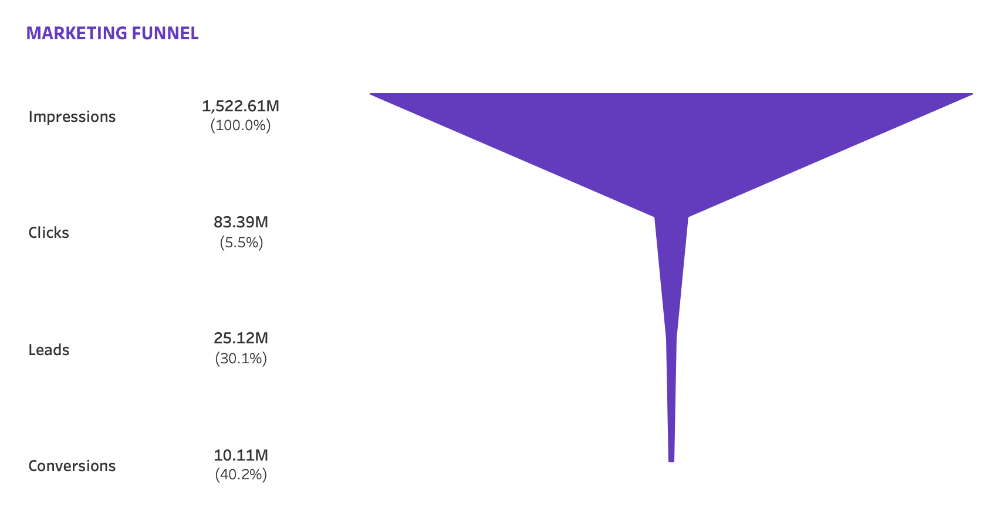
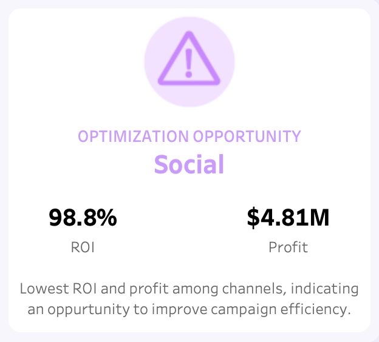
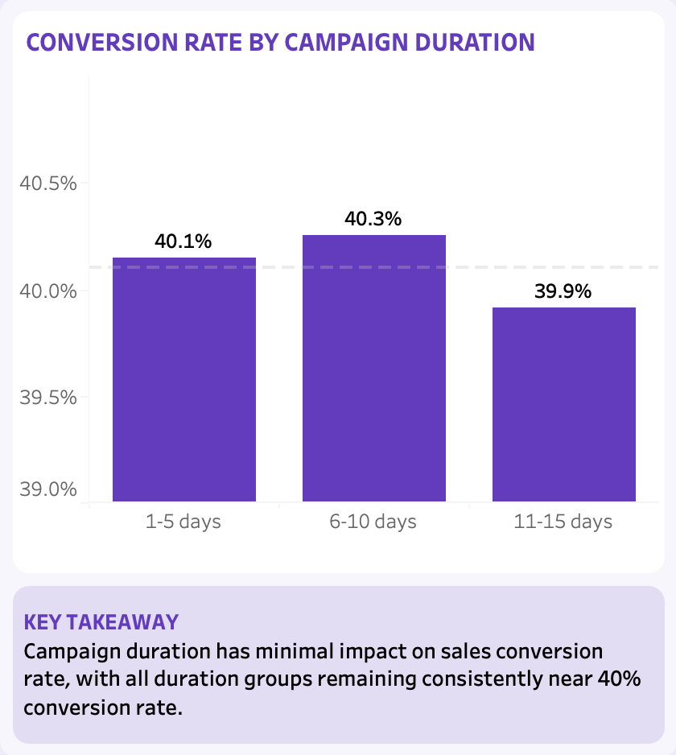
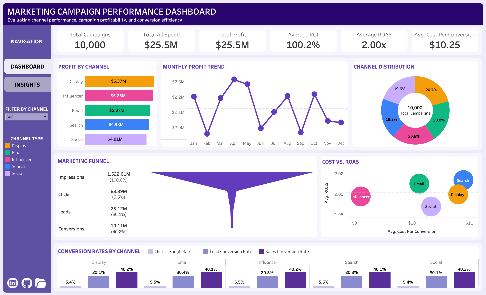
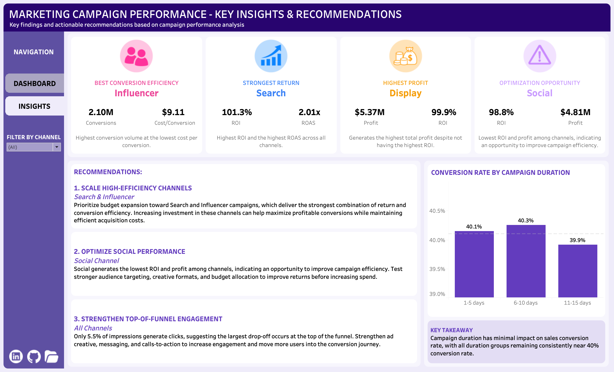

# Marketing Campaign Performance Analysis
## Project Overview
This project analyzes the performance of 10,000 marketing campaigns across five advertising channels (Display, Email, Influencer, Search, and Social). The analysis evaluates campaign profitability, return on investment (ROI), return on ad spend (ROAS), conversion efficiency, and performance throughout the marketing funnel, from impressions and clicks to leads and conversions. The goal is to identify high-performing channels, uncover optimization opportunities, and translate campaign performance data into actionable business recommendations. 
- **Tableau Public Dashboard:** [View Interactive Dashboard](https://public.tableau.com/app/profile/nicole.beri/viz/Marketing_Campaign_Performance_Analysis/MainDashboard)

## Business Objective
The analysis aims to maximize capital efficiency and optimize funnel performance by identifying which channels deliver the strongest returns and conversion performance, pinpointing underperformance, and assessing where improvements can be made across the marketing funnel.

## Data
The dataset contains marketing campaign performance data across the following advertising channels:
- Display
- Email
- Influencer
- Search
- Social

Key metrics include impressions, clicks, leads, conversions, cost, revenue, and ROI.

The original dataset was obtained from Kaggle. The original Kaggle listing is no longer available; a copy of the original dataset used for this analysis is included in the [Data](https://github.com/nberi-data/marketing-campaign-performance-analysis/tree/main/data) folder of this repository. 
- **Data Source:** [View Dataset](https://raw.githubusercontent.com/nberi-data/marketing-campaign-performance-analysis/refs/heads/main/data/marketing_campaign_dataset.csv)

## Tools & Skills Used
- **SQL:** data validation, cleaning, transformation, feature engineering, and analysis.
- **Tableau:** interactive dashboard design, data visualization, calculated fields, dynamic filters, and data storytelling.

## Data Validation 
The dataset was validated using SQL prior to analysis. 

Data quality checks confirmed:
- 10,000 unique campaign records (no duplicates)
- No null values
- No negative values in numerical performance metrics
- No chronological errors between campaign start and end dates
- No violations in the expected marketing funnel sequence

View the data validation and quality check queries here: [sql/01_data_validation.sql](sql/01_data_validation.sql)

## Data Cleaning & Transformation
Following data validation, the original dataset was transformed into a new analysis-ready table using SQL. New features and calculated metrics were derived from existing campaign data to support more detailed performance analysis. 

The transformation included creating:
- **Date-based features:** campaign duration, month, and quarter
- **Engagement metrics:** click-through rate (CTR)
- **Conversion metrics:** lead conversion rate & sales conversion rate
- **Cost efficiency metrics:** cost per lead & cost per conversion
- **Return metrics:** return on ad spend (ROAS) & profit

The resulting table consolidated the original data with these newly derived features, providing a clean and structured dataset for analysis and Tableau visualization.

View the data cleaning and transformation queries here: [sql/02_data_cleaning_transformation.sql](sql/02_data_cleaning_transformation.sql)

## Data Analysis
The cleaned dataset was analyzed using SQL to evaluate campaign performance across channels, time periods, and campaign characteristics. 

The analysis focused on:
- **Overall campaign performance:** evaluating total campaigns, ad spend, revenue, profit, ROI, ROAS, and CTR.
- **Channel performance:** comparing profitability, ROI, and ROAS across marketing channels.
- **Conversion & engagement efficiency:** analyzing CTR, lead conversion rates, sales conversion rates, and acquisition costs by channel.
- **Time-based performance:** examining campaign performance across monthly and quarterly periods.
- **Campaign profitability:** identifying the top 10 campaigns by profit.
- **Campaign duration:** evaluating whether campaign length influences profitability, ROAS, and sales conversion rates.

View the data analysis queries here: [sql/03_data_analysis.sql](sql/03_data_analysis.sql)

## Key Insights
### 1. Display Leads in Profit, While Influencer & Search Lead in Efficiency
Although Display generates the highest total profit at $5.37M, Influencer and Search demonstrate stronger overall efficiency. Influencer achieves the lowest cost per conversion at $9.11 and generates 2.10M conversions, while Search delivers the highest ROI at 101.3% and the highest ROAS of 2.01×.
 

### 2. The Largest Funnel Drop-Off Occurs at the Top of the Funnel
Only 5.5% of impressions resulted in clicks, representing the largest drop-off in the marketing funnel. In comparison, 30.1% of clicks generated leads and 40.2% of leads converted into sales. This suggests that improving top-of-funnel engagement could have the greatest potential to increase conversions.
 

### 3. Social Presents the Largest Optimization Opportunity
Social generated the lowest ROI at 98.8% and the lowest total profit at $4.81M among the five channels. The results suggest an opportunity to improve targeting, creative strategy, and budget allocation.
 

### 4. Campaign Duration Has Minimal Impact on Sales Conversion
Campaign duration has very little impact on sales conversion rates. Campaigns lasting 1–5 days achieved a 40.1% sales conversion rate, compared with 40.3% for 6–10 day campaigns, and 39.9% for campaigns lasting 11–15 days.
 

## Recommendations
### 1. Scale High-Efficiency Channels: 
Prioritize budget expansion toward Search and Influencer campaigns, which deliver the strongest combination of return and conversion efficiency. Increasing investment in these channels can help maximize profitable conversions while maintaining efficient acquisition costs.

### 2. Optimize Social Channel Performance: 
Social generates the lowest ROI and profit among channels, indicating an opportunity to improve campaign efficiency. Test stronger audience targeting, creative formats, and budget allocation to improve returns before increasing spend.

### 3. Strengthen Top-of-Funnel Engagement: 
Only 5.5% of impressions generate clicks, suggesting the largest drop-off occurs at the top of the funnel. Strengthen ad creative, messaging, and calls-to-action to increase engagement and move more users into the conversion journey.

## Dashboard Preview

